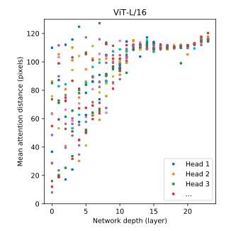
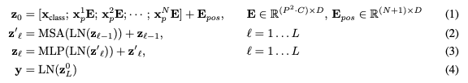

# ViT (Vision Transformer)

Transformers first transitioned to Computer Vision with the introduction of the **Vision Transformer (ViT)** in [**"An Image is Worth 16x16 Words: Transformers for Image Recognition at Scale"** (Dosovitskiy et al., 2020)](https://arxiv.org/pdf/2010.11929). ViT adapted the Transformer architecture to process images as sequences of patches, capturing global context effectively and outperforming CNNs on large datasets, setting a new standard in CV.

## Key Insights
**Field of View**: 
  - **CNNs**: Limited by local receptive fields; require deep stacking of layers to gain larger receptive fields.
  - **Transformers**: Capture global information without extensive stacking, offering a broader view even in shallow layers.
  
A shallow Transformer (e.g., 5 layers) can achieve similar or better global information capture compared to a deep CNN (e.g., 30 layers).

## Vision Transformer (ViT) Architecture
- **Patch-based Input**:
  - The image is divided into fixed-size patches and each patch is linearly projected to a feature vector of dimension D.
- **Additional Tokens**:
  - A class token is prepended to represent the overall image classification.
- **Position Embedding**:
  - Retains spatial information within the patch sequence.
  - **1D vs. 2D**: Experiments show simple 1D position encoding often suffices.

  

- **Layer Normalization**: Maintains consistent scaling of inputs to subsequent layers (stable training).
- **Attention Mechanism**:
  - Re-combination of input vectors (by computing attention scores between all patch tokens) to capture improved feature representations.
- **Residual Connections**: Improve gradient flow and stability.
- **Multi-layer Perceptrons (MLP)**: for feature transformation
- **Output Consistency**: The output dimensions match the input for effective stacking of multiple(L) layers.

